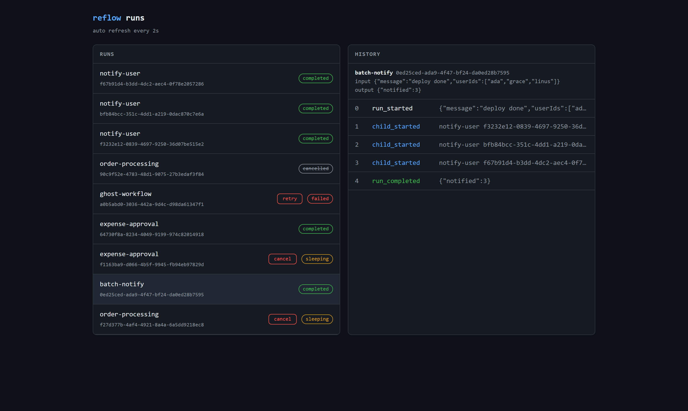

<div align="center">
  <h1 align="center">reflow</h1>
  <p align="center">Durable workflow engine for TypeScript, built on Postgres</p>
</div>

<p align="center">
  <a href="https://github.com/quatrecentdouze/reflow/actions/workflows/ci.yml"></a>
  
  
  
  
</p>

reflow lets you write multi step business processes as plain async code and executes them durably. Every step is persisted in an event history, so a workflow survives crashes and deploys, retries failures with backoff, sleeps for days and waits for human input. Think of it as a mini [Temporal](https://temporal.io) you can read in an afternoon.

## Key Features

* **Durable steps**: every side effect is recorded, a crashed run resumes exactly where it stopped
* **Retries and timers**: exponential backoff per step, `ctx.sleep()` that survives restarts
* **Signals**: suspend a run for minutes or weeks until a human or a webhook decides, with optional timeouts
* **Child workflows**: compose workflows, a parent awaits its children and never re-runs them on replay
* **Versioning**: ship new workflow code while old runs are still in flight
* **Scheduling**: delayed starts, fixed intervals or cron expressions
* **Horizontal scaling**: start more workers, they coordinate through Postgres, no extra broker

## How It Works

Every durable operation (`step`, `sleep`, `waitForSignal`, `child`) is appended to an event history. When a worker picks up a run, it re-executes the workflow function from the top against that history: recorded operations return their stored result instantly with no side effects, and execution continues live from the first unrecorded one.

> [!NOTE]
> **Deterministic replay** is the whole trick. Workflow code must be deterministic outside of steps: keep side effects, `Date.now()` and `Math.random()` inside `ctx.step()` or use the `ctx.now()` / `ctx.random()` helpers. If code and history diverge, reflow fails the run with a `NondeterminismError` instead of corrupting state.

Workers claim runs with `FOR UPDATE SKIP LOCKED`, so any number of them can poll the same table without ever double-executing a run. A lock heartbeat detects dead workers and their runs get taken over automatically.

> [!TIP]
> **Steps are at least once.** A crash after a side effect but before it is recorded means the step runs again on resume, so make your steps idempotent, same as with any queue based system.



## Quick Start

Needs Node 22+ and pnpm. No Docker, no database setup, the demo embeds Postgres (PGlite) in process:

```bash
pnpm install
pnpm demo
```

Open http://localhost:3000 for the web ui, then start a run:

```bash
curl -X POST http://localhost:3000/api/workflows/order-processing/runs \
     -H "content-type: application/json" \
     -d '{"input": {"orderId": "order-1", "amount": 99}}'
```

### The Durability Demo

For the real setup with Postgres and separate processes:

```bash
docker compose up -d
pnpm build
pnpm --filter @reflow/server start   # terminal 1
pnpm --filter @reflow/worker start   # terminal 2
```

1. Start an `order-processing` run (curl above), the flaky payment gateway starts retrying
2. Kill the worker mid run, Ctrl+C or `kill -9`
3. Restart it: the run resumes at the exact step where it stopped, nothing re-executes

## Usage Examples

### Defining a Workflow

```ts
export const orderProcessing = defineWorkflow({
  name: "order-processing",
  async run(ctx, input: { orderId: string; amount: number }) {
    await ctx.step("reserve-inventory", () => inventory.reserve(input.orderId));

    const charge = await ctx.step(
      "charge-payment",
      () => payments.charge(input.orderId, input.amount),
      { retry: { maxAttempts: 5, initialDelayMs: 3_000, backoffFactor: 2 } },
    );

    await ctx.sleep(7 * 24 * 3_600_000);

    await ctx.step("send-follow-up-email", () => emails.followUp(input.orderId));

    return { status: "fulfilled", chargeId: charge.id };
  },
});
```

### Human in the Loop, With a Deadline

```ts
const decision = await ctx.waitForSignal<Decision>("decision", { timeoutMs: 86_400_000 });
if (!decision.received) {
  await ctx.step("escalate", () => notifyManager());
}
```

### Child Workflows

```ts
for (const userId of input.userIds) {
  await ctx.child("notify-user", { userId, message: input.message });
}
```

### Versioning a Live Workflow

```ts
if ((await ctx.version("insert-step-c", 1)) >= 1) {
  await ctx.step("step-c", () => stepC());
}
```

## API

| Method | Path                              | Description                              |
|--------|-----------------------------------|------------------------------------------|
| GET    | `/`                               | web ui                                   |
| POST   | `/api/workflows/:name/runs`       | start a run (`{ input, startAt? }`)      |
| GET    | `/api/runs`                       | list runs (`?status=`, `?limit=`)        |
| GET    | `/api/runs/:id`                   | run state (`?include=history`)           |
| GET    | `/api/runs/:id/history`           | paged events (`?offset=`, `?limit=`)     |
| POST   | `/api/runs/:id/signals/:name`     | deliver a signal (`{ payload }`)         |
| POST   | `/api/runs/:id/retry`             | retry a failed run                       |
| POST   | `/api/runs/:id/cancel`            | cancel a run                             |
| POST   | `/api/workflows/:name/schedules`  | create a schedule (`{ input, intervalMs \| cron }`) |
| GET    | `/api/schedules`                  | list schedules                           |
| DELETE | `/api/schedules/:id`              | delete a schedule                        |
| POST   | `/api/maintenance/purge`          | delete finished runs (`{ olderThanMs }`) |

## Architecture

```
packages/core            engine: replay executor, worker runtime (zero deps)
packages/sdk             workflow authoring api
packages/store-postgres  storage, works on pg and pglite
apps/server              rest api + web ui (fastify)
apps/worker              worker process
apps/demo                single process demo
```

## Development

```bash
pnpm test    # 50+ tests against an embedded postgres, no infra needed
```

## License

[MIT](./LICENSE)
