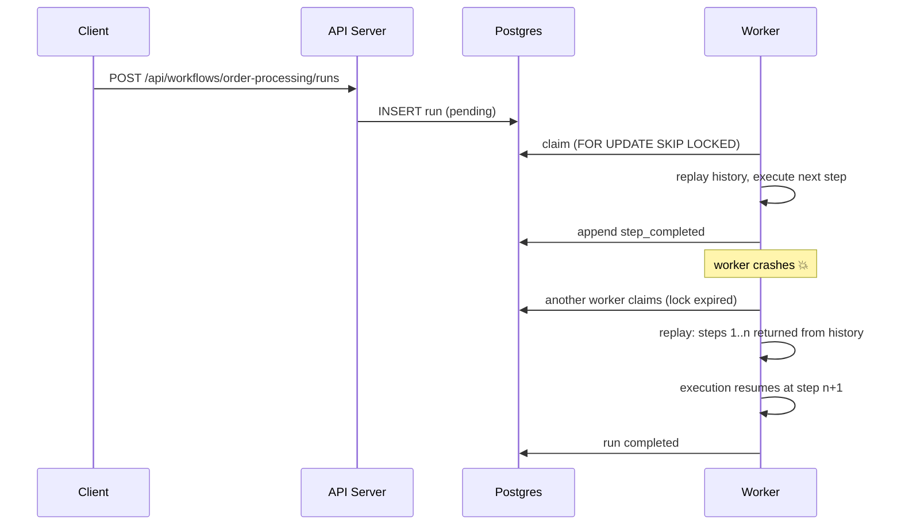

# reflow

[](https://github.com/quatrecentdouze/reflow/actions/workflows/ci.yml)

durable workflow engine for typescript, built on postgres. you write multi step processes as plain async code and reflow persists every step, so it survives crashes, retries failures, can sleep for days and wait for human input. basically a mini temporal

```ts
export const orderProcessing = defineWorkflow({
  name: "order-processing",
  async run(ctx, input: { orderId: string; amount: number }) {
    await ctx.step("reserve-inventory", () => inventory.reserve(input.orderId));

    const charge = await ctx.step(
      "charge-payment",
      () => payments.charge(input.orderId, input.amount),
      { retry: { maxAttempts: 5, initialDelayMs: 3_000, backoffFactor: 2 } },
    );

    await ctx.step("ship-order", () => shipping.dispatch(input.orderId));

    await ctx.sleep(7 * 24 * 3_600_000);

    await ctx.step("send-follow-up-email", () => emails.followUp(input.orderId));

    return { status: "fulfilled", chargeId: charge.id };
  },
});
```

kill the worker anywhere in this workflow then restart it. execution resumes exactly where it stopped, completed steps are not re-executed, they get replayed from history

## why

every backend ends up with processes that outlive a single request. payment flows, onboarding, report pipelines, approval chains. the usual fix is a pile of queues, cron jobs and state columns that reimplement half an orchestrator badly. reflow gives you the actual primitive, durable execution. your process is code, its progress is data

## quick start

needs node 22+ and pnpm. no docker, no db setup, the demo runs an embedded postgres (pglite) in process

```bash
pnpm install
pnpm demo
```

then in another terminal

```bash
# start an order workflow, the payment gateway is flaky on purpose, watch the retries in the logs
curl -X POST http://localhost:3000/api/workflows/order-processing/runs \
     -H "content-type: application/json" \
     -d '{"input": {"orderId": "order-1", "amount": 99}}'

# inspect the run and its full event history
curl "http://localhost:3000/api/runs/<RUN_ID>?include=history"
```

## real setup, postgres + separate processes

```bash
docker compose up -d
pnpm install && pnpm build

pnpm --filter @reflow/server start   # terminal 1
pnpm --filter @reflow/worker start   # terminal 2
```

### the durability demo

1. start an order-processing run (curl above)
2. watch the worker logs, reserve-inventory completes, charge-payment starts retrying
3. kill the worker mid run, ctrl+c or `kill -9`
4. restart it. the run resumes at the exact step where it stopped

you can also start several workers, they coordinate through `FOR UPDATE SKIP LOCKED` claiming so a run is never executed twice, and runs owned by a dead worker get picked up once its lock expires

### human in the loop

```bash
curl -X POST http://localhost:3000/api/workflows/expense-approval/runs \
     -H "content-type: application/json" \
     -d '{"input": {"employee": "ada", "amount": 1200, "reason": "conference"}}'

# the run now sleeps, for minutes or weeks, until someone decides
curl -X POST http://localhost:3000/api/runs/<RUN_ID>/signals/decision \
     -H "content-type: application/json" \
     -d '{"payload": {"approved": true, "reviewer": "grace"}}'
```

## how it works

every durable operation (`step`, `sleep`, `waitForSignal`) is recorded in an append only event history

| seq | event            | payload                                        |
|-----|------------------|------------------------------------------------|
| 0   | `run_started`    | `{ orderId: "order-1", amount: 99 }`           |
| 1   | `step_completed` | `reserve-inventory` -> `{ reserved: true }`    |
| 2   | `step_failed`    | `charge-payment`, attempt 1, retry at +3s      |
| 3   | `step_failed`    | `charge-payment`, attempt 2, retry at +6s      |
| 4   | `step_completed` | `charge-payment` -> `{ chargeId: "ch_3c02" }`  |
| 5   | `timer_started`  | wake at +7 days                                |

when a worker picks up a run it re-executes the workflow function from the top against this history. operations already recorded return their stored result instantly, no side effects, and execution continues live from the first unrecorded operation. thats deterministic replay, the whole trick behind durable execution



one consequence, workflow code must be deterministic outside of steps. no `Date.now()`, no `Math.random()`, no raw i/o in the workflow body, put that stuff inside `ctx.step()`. if code and history diverge, like a step renamed while runs are in flight, reflow fails the run with a `NondeterminismError` instead of corrupting state

## architecture

```
packages/
  core            engine: replay executor, worker runtime, contracts (zero runtime deps)
  sdk             workflow authoring api (defineWorkflow)
  store-postgres  WorkflowStore implementation, works on pg and pglite
  examples        demo workflows
apps/
  server          rest api (fastify + zod)
  worker          worker process
  demo            single process demo on embedded postgres
```

the engine only knows the `WorkflowStore` interface, storage is pluggable. the postgres implementation takes anything with a `query()` method, thats how the test suite runs the real store on an embedded postgres with zero infra, in ci too

## api

| Method | Path                              | Description                          |
|--------|-----------------------------------|--------------------------------------|
| POST   | `/api/workflows/:name/runs`       | start a run (`{ input }`)            |
| GET    | `/api/runs`                       | list runs (`?status=`, `?limit=`)    |
| GET    | `/api/runs/:id`                   | run state (`?include=history`)       |
| POST   | `/api/runs/:id/signals/:name`     | deliver a signal (`{ payload }`)     |
| GET    | `/health`                         | health check                         |

## guarantees and limits

- steps are at least once. a crash after a side effect but before its recorded means the step runs again on resume, make your steps idempotent
- one worker per run at a time, lock claiming + heartbeats, expired locks (dead workers) get taken over automatically
- inputs, outputs and step results must be json serializable
- this is a learning grade engine, not a temporal replacement. no versioning, no partitioned event store, no exactly once semantics

## roadmap

- [ ] workflow versioning
- [ ] deterministic `ctx.now()` / `ctx.random()`
- [ ] child workflows
- [ ] cron / scheduled runs
- [ ] web ui for run histories
- [ ] dead letter handling and manual replay

## dev

```bash
pnpm install
pnpm build
pnpm test        # engine + api tests on embedded postgres
```

## license

[MIT](./LICENSE)
